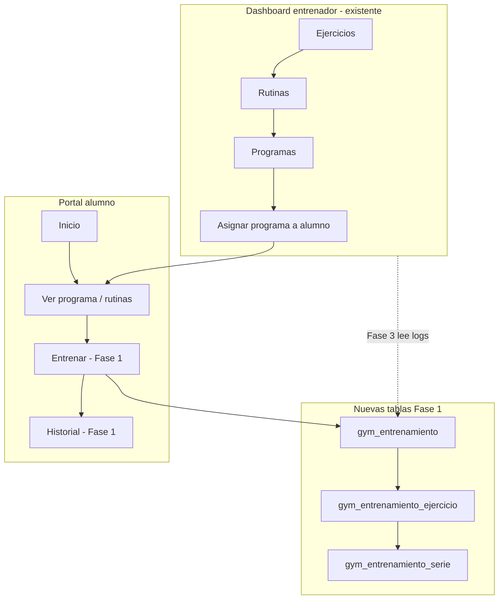
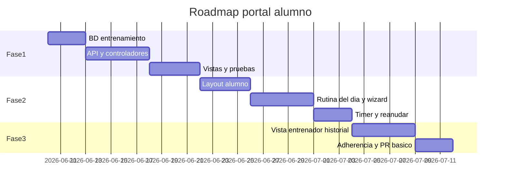

# Plan: Portal alumno — entrenar y registrar progreso

Rama objetivo: `feature/gym`  
Estado actual: el alumno ya puede registrarse, ver programas asignados y consultar rutinas/ejercicios en **solo lectura**.  
Meta: que pueda **iniciar un entrenamiento**, **registrar series** y que el **entrenador vea el progreso**.

---

## Resumen por fases

| Fase | Objetivo | Duración orientativa | Entregable clave |
|------|----------|----------------------|------------------|
| **1 — MVP registrar** | Flujo completo mínimo en web | 1–2 semanas | Empezar → marcar series → historial |
| **2 — Móvil y UX** | Experiencia usable en teléfono | +1–1,5 semanas | Layout alumno + rutina del día + descanso |
| **3 — Entrenador** | Visibilidad y métricas para el coach | +1–1,5 semanas | Panel progreso, adherencia, récords |

**Total orientativo:** 3–5 semanas de desarrollo enfocado (sin contar diseño premium ni app nativa).

---

## Arquitectura objetivo



---

## Fase 1 — MVP: entrenar y registrar (funcional en desktop)

### Objetivo

El alumno puede **iniciar una sesión** desde una rutina asignada, **registrar peso/reps por serie**, **finalizar** y ver un **historial simple**. Sin timers ni layout dedicado; prioridad: que los datos queden en BD.

### 1.1 Base de datos

**Archivo:** `database/migrations/2026-06-XX_gym_entrenamiento.sql` (y reflejo en `database/schema_gym.sql`)

| Tabla | Propósito |
|-------|-----------|
| `gym_entrenamiento` | Sesión: `usuario_id`, `rutina_id`, `programa_id` (opcional), `programa_usuario_id` (opcional), `iniciado_en`, `finalizado_en`, `estado` (`en_curso`, `completado`, `abandonado`), `notas` |
| `gym_entrenamiento_ejercicio` | Snapshot por ejercicio en la sesión: `entrenamiento_id`, `ejercicio_id`, `orden`, `series_planificadas`, `reps_planificadas`, `descanso_seg` (copiados de `gym_rutina_ejercicio` al iniciar) |
| `gym_entrenamiento_serie` | Cada serie realizada: `entrenamiento_ejercicio_id`, `numero_serie`, `peso_kg`, `repeticiones`, `completada` (S/N), `notas` |

**Reglas de negocio:**

- Solo un `en_curso` por alumno (al iniciar nuevo, preguntar si abandonar el anterior o reanudar).
- Validar que la rutina pertenece a un programa **asignado y activo** al alumno (`gym_programa_usuario` + join `gym_programa_rutina`).

### 1.2 Backend (CodeIgniter)

**Nuevos archivos sugeridos:**

| Componente | Ruta / responsabilidad |
|------------|----------------------|
| `App\Models\Gym\Entrenamiento` | CRUD sesión + relaciones |
| `App\Services\Gym\EntrenamientoService` | Iniciar sesión (copiar ejercicios), guardar serie, finalizar |
| `App\Controllers\Alumno\RutinaController` | Ver rutina, iniciar, pantalla entrenar, AJAX guardar serie, finalizar |
| `App\Controllers\Alumno\HistorialController` | Lista y detalle de sesiones pasadas |

**Rutas** (`app/Config/Routes.php`, grupo `alumno` + filter `alumno`):

```
GET  alumno/rutina/(:num)              → RutinaController::ver
POST alumno/rutina/(:num)/iniciar     → RutinaController::iniciar
GET  alumno/entrenamiento/(:num)      → EntrenamientoController::ejecutar (pantalla activa)
POST alumno/entrenamiento/(:num)/serie → guardar/actualizar serie
POST alumno/entrenamiento/(:num)/finalizar
GET  alumno/historial                 → HistorialController::index
GET  alumno/historial/(:num)          → HistorialController::detalle
```

### 1.3 Vistas (Fase 1 — layout actual `dashboard`)

| Vista | Contenido |
|-------|-----------|
| `app/Views/alumno/rutina_ver.php` | Detalle rutina + botón **Empezar entrenamiento** |
| `app/Views/alumno/entrenar.php` | Lista de ejercicios; por cada uno, filas de series (peso, reps, checkbox completada) |
| `app/Views/alumno/historial_lista.php` | Fecha, rutina, duración, estado |
| `app/Views/alumno/historial_detalle.php` | Resumen de la sesión |

**Ajuste técnico incluido en Fase 1:** registrar secciones `alumno/*` en `app/Views/layout/dashboard.php` (hoy las vistas extienden dashboard pero las secciones no se renderizan).

### 1.4 Criterios de aceptación (Fase 1)

- [ ] Alumno con programa asignado ve rutina y puede pulsar **Empezar**.
- [ ] Se crea `gym_entrenamiento` en estado `en_curso` con ejercicios copiados de la rutina.
- [ ] Puede marcar series completadas e ingresar peso/reps; persiste en BD.
- [ ] **Finalizar** cambia estado a `completado` y guarda `finalizado_en`.
- [ ] Historial muestra al menos las últimas 20 sesiones.
- [ ] No puede iniciar rutina de un programa no asignado (403 o mensaje claro).

### 1.5 Fuera de alcance Fase 1

- Timer de descanso, vídeos, gráficos, PR automáticos.
- Layout móvil dedicado (solo responsive Bootstrap).
- Panel entrenador.

---

## Fase 2 — Experiencia móvil y rutina del día

### Objetivo

Que el alumno use el gym **desde el celular** con la misma fluidez que en PC: navegación simple, **qué toca hoy**, reanudar sesión y **timer de descanso**.

### 2.1 Layout alumno

**Nuevos archivos:**

- `app/Views/layout/alumno.php` — sin sidebar staff; header compacto.
- `lib/css/nutrinext-alumno.css` — tipografía grande, botones 48px+, bottom nav.
- `app/Views/alumno/partials/bottom_nav.php` — Inicio | Entrenar | Historial | Cuenta.

**Migración de vistas:** `inicio`, `programa_ver`, `rutina_ver`, `entrenar`, `historial_*` pasan a `extend('layout/alumno')`.

**Login:** tras `inicio_sesion`, si perfil Alumno → redirect `alumno/inicio` (verificar en `UsuarioController`).

### 2.2 Rutina del día

**Lógica en `InicioController` o `EntrenamientoService`:**

- Leer `gym_programa_rutina.dia_semana` (1=Lun … 7=Dom).
- Mostrar card **“Hoy toca: {rutina}”** con CTA directo **Empezar**.
- Si hay sesión `en_curso`, card **“Continuar entrenamiento”**.

### 2.3 Modo entrenamiento mejorado

| Mejora | Detalle |
|--------|---------|
| Vista por ejercicio | Un ejercicio a la vez + “Siguiente” (wizard) |
| Timer descanso | Countdown usando `descanso_seg` de la rutina; vibración opcional |
| Progreso | Barra “3/8 ejercicios” |
| Offline liviano | Opcional: `localStorage` borrador si pierde señal (nice-to-have) |

**Rutas extra (opcional):**

```
GET alumno/entrenamiento/(:num)/ejercicio/(:num)
```

### 2.4 Reanudar / abandonar

- Modal al iniciar si ya hay `en_curso`: **Continuar** | **Abandonar y empezar nueva**.
- Abandonar marca `abandonado` con timestamp.

### 2.5 Criterios de aceptación (Fase 2)

- [ ] Portal alumno no muestra menú lateral del entrenador.
- [ ] Bottom nav funciona en iOS/Android (viewport, safe-area).
- [ ] Inicio muestra rutina sugerida para el día (si el programa define días).
- [ ] Timer de descanso arranca al completar una serie.
- [ ] Flujo wizard usable con una mano en pantalla &lt; 400px.

---

## Fase 3 — Visibilidad para el entrenador

### Objetivo

El entrenador ve **qué hizo el alumno**, **adherencia** y evolución básica (peso/reps), sin salir del dashboard gym.

### 3.1 Dashboard entrenador

**Ubicación sugerida:** ampliar `app/Views/Modulos/gym/alumno/editar.php` o pestaña en detalle alumno.

| Bloque | Contenido |
|--------|-----------|
| Resumen | Sesiones últimos 30 días, % rutinas completadas vs planificadas |
| Tabla sesiones | Fecha, rutina, duración, estado, enlace detalle |
| Por ejercicio | Último peso/reps vs anterior (flecha ↑↓) |
| Récord simple | Max peso por ejercicio (PR manual, sin gráfico complejo) |

**Rutas staff:**

```
GET dashboard/gym/alumno/entrenamientos/(:num)      → JSON o vista parcial
GET dashboard/gym/alumno/entrenamiento/(:num)     → detalle sesión (solo lectura)
```

**Permisos:** mismo módulo `dashboard/gym/alumno`; `SessionFilter` ya cubre sub-rutas si se añade excepción o registro en `modulo_detalle`.

### 3.2 Reportes opcionales (si hay tiempo en Fase 3)

- Export CSV sesiones de un alumno.
- Notificación al entrenador cuando alumno completa sesión (reutilizar `NotificacionNutricionistaService` o evento simple).

### 3.3 Criterios de aceptación (Fase 3)

- [ ] Desde lista/edición de alumno gym, el entrenador ve historial de entrenamientos.
- [ ] Detalle de sesión muestra ejercicios y series registradas.
- [ ] Indicador de adherencia semanal (ej. “2/3 entrenamientos”).
- [ ] Solo datos de alumnos de su `empresa_id`.

---

## Dependencias entre fases



**Fase 2 depende de Fase 1** (tablas y flujo de guardado).  
**Fase 3 depende de Fase 1** (datos); puede desarrollarse en paralelo parcial con Fase 2 si hay dos personas.

---

## Orden de implementación recomendado (checklist)

### Fase 1
1. Migración SQL + modelos  
2. `EntrenamientoService::iniciarDesdeRutina()`  
3. `RutinaController` + `EntrenamientoController`  
4. Vistas + fix `renderSection` en dashboard  
5. Prueba E2E manual: asignar programa → alumno entrena → entrenador ve en BD  

### Fase 2
6. `layout/alumno.php` + CSS + bottom nav  
7. Redirect login alumno  
8. Card “Hoy toca” en inicio  
9. Refactor `entrenar.php` a wizard + timer JS  

### Fase 3
10. Endpoint/vista entrenamientos en `AlumnoController` (dashboard)  
11. Adherencia + comparación última serie  
12. SQL permisos si hace falta (`modulo_detalle` ruta `entrenamientos`)

---

## Riesgos y decisiones a cerrar antes de codificar

| Tema | Opciones | Recomendación |
|------|----------|---------------|
| ¿Peso en kg o lb? | Config empresa vs fijo kg | **kg** en MVP; config en Fase 3 |
| ¿Editar series planificadas en vivo? | Sí / No | **No** en Fase 1; solo registrar lo hecho |
| ¿Varias sesiones mismo día? | Permitir / Una por rutina/día | **Permitir** varias; el coach filtra por fecha |
| ¿Suscripción obligatoria para entrenar? | Bloquear si no paga | **No** en MVP; validar solo asignación programa |
| Layout dashboard alumno | Mantener vs separar | **Separar en Fase 2** |

---

## Qué ya no hay que construir

- Registro/login alumno (existe).
- CRUD ejercicios, rutinas, programas, asignación (existe).
- Ver programa y listado de ejercicios de rutina (existe en `programa_ver.php`; se puede enlazar a `rutina_ver` con botón entrenar).

---

## Siguiente paso

Aprobar este plan y arrancar **Fase 1** con la migración `gym_entrenamiento*` + `RutinaController::iniciar` + vista `entrenar.php`.

Documento vivo: actualizar checkboxes al cerrar cada ítem en la rama `feature/gym`.
