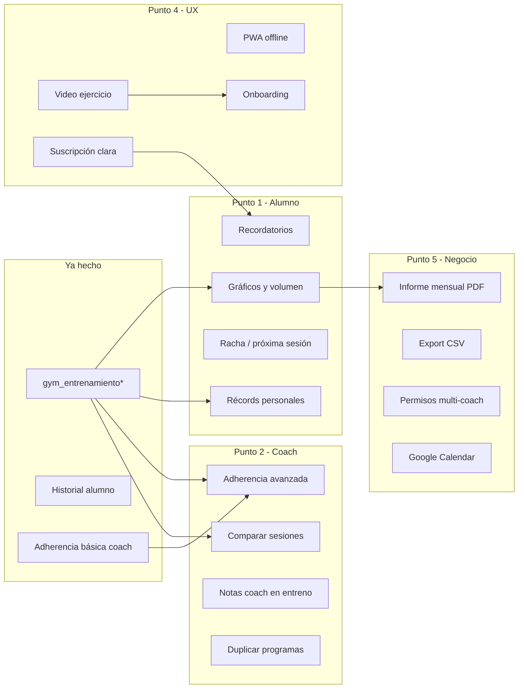

# Roadmap: valor gym — puntos 1, 2, 4 y 5

Rama objetivo: `feature/gym`  
Complementa: [gym-portal-alumno-entrenamiento-plan.md](./gym-portal-alumno-entrenamiento-plan.md)  
Estado base (may 2026): portal alumno con entrenar, historial, layout móvil; dashboard gym con CRUD + adherencia básica en ficha alumno; tablas `gym_entrenamiento*`.

Este documento ordena **qué falta**, **en qué orden** y **cómo encaja** con NutriNext existente.

---

## Mapa de los 4 bloques

| # | Bloque | Para quién | Valor principal |
|---|--------|------------|-----------------|
| **1** | Progreso y retención alumno | Alumno | De “formulario” a motivación (gráficos, PR, racha) |
| **2** | Coach con datos | Entrenador | Adherencia accionable, comparar sesiones, notas, plantillas |
| **4** | Experiencia y confianza | Alumno + gym | Videos, PWA, onboarding, suscripción visible |
| **5** | Operación del negocio | Dueño gym / admin | Multi-coach, informes PDF, exportaciones, integraciones |

**Duración orientativa total:** 8–14 semanas (1 dev enfocado), en sprints de 1–2 semanas.

---

## Dependencias entre bloques



**Orden recomendado de implementación:**  
1 → 2 (paralelo parcial con 4) → 4 (quick wins) → 5.

---

## Punto 1 — Alumno: progreso y retención

### Objetivo

Que el alumno **vea que avanza** sin depender del entrenador.

### 1.1 MVP (Sprint A — ~1,5 sem)

| Feature | Descripción | Técnico |
|---------|-------------|---------|
| **Mi progreso** | Pantalla `alumno/progreso` con resumen 30 días | `ProgresoService`: consultas sobre `gym_entrenamiento_serie` + joins |
| **Volumen semanal** | Gráfico barras: kg×reps por semana (últimas 8) | ApexCharts (ya en dashboard) o Chart.js en layout alumno |
| **Peso por ejercicio** | Línea: max peso por ejercicio (selector) | Reutilizar `ultimoPesoEjercicio`; ampliar a serie histórica |
| **Racha** | “Llevás X días seguidos entrenando” | Contar días con `estado=completado` consecutivos |
| **Próxima sesión** | Mejorar “Hoy toca”: rutina pendiente si abandonó ayer | Extender `rutinaDelDia()` + flag sesión incompleta |

**Rutas nuevas:**

```
GET alumno/progreso              → ProgresoController::index
GET alumno/progreso/ejercicio/(:num) → JSON serie histórica (AJAX gráfico)
```

**Criterios de aceptación:**

- [ ] Alumno con ≥3 sesiones ve gráfico de volumen.
- [ ] Al elegir ejercicio, ve evolución de peso máximo.
- [ ] Inicio muestra racha y próxima rutina coherente.

### 1.2 PR automáticos (Sprint B — ~1 sem)

| Feature | Descripción | Técnico |
|---------|-------------|---------|
| **Detección PR** | Al guardar serie, si peso > max histórico → flag | En `EntrenamientoService::guardarSerie` o evento post-save |
| **Badge en entreno** | Toast/modal “¡Nuevo récord!” | Respuesta JSON `{ pr: true, peso_anterior: X }` |
| **Listado PR** | Sección en progreso: últimos 10 PR | Tabla derivada o cache `gym_ejercicio_pr` (opcional) |

**Tabla opcional** (optimización, no obligatoria en MVP):

```sql
gym_ejercicio_pr (usuario_id, ejercicio_id, peso_kg, repeticiones, entrenamiento_serie_id, logrado_en)
```

### 1.3 Recordatorios (Sprint C — ~1 sem)

| Canal | Alcance MVP |
|-------|-------------|
| **Email** | Command `php spark gym:recordatorio-entreno` (cron diario 8:00) |
| **WhatsApp** | Fase 2: plantilla Twilio si empresa tiene módulo WhatsApp activo |

**Reglas:**

- Solo alumnos con programa activo y **sin sesión completada hoy** (si tienen rutina ese día).
- Opt-out en perfil alumno (`recibir_recordatorios` en `usuario` o tabla preferencias).

**Reutilizar:** infra email NutriNext, patrón de `EnviarRecordatoriosWhatsApp` (rama gcp).

---

## Punto 2 — Coach: datos que monetizan

### Objetivo

El entrenador **actúa** con la info (no solo la ve).

### 2.1 Adherencia avanzada (Sprint D — ~1 sem)

**Ya existe:** tarjetas % en `Modulos/gym/alumno/editar`.

**Ampliar:**

| Vista | Contenido |
|-------|-----------|
| Ficha alumno | Calendario heatmap 4 semanas (verde=entrenó, gris=no) |
| Lista alumnos | Columna adherencia % + badge “riesgo” si &lt;50% |
| Dashboard gym | Widget “Alumnos sin entrenar 7 días” |

**Servicio:** extender `EntrenamientoService::adherenciaSemanal` → `adherenciaDetalle($usuarioId, $desde, $hasta)`.

### 2.2 Comparar sesiones (Sprint E — ~1,5 sem)

| Feature | Descripción |
|---------|-------------|
| **Historial alumno (coach)** | Clic en sesión → detalle series (como portal alumno) |
| **Comparar 2 sesiones** | Misma rutina: sesión A vs B (peso/reps por ejercicio) |
| **Última vs hoy** | En ficha: “Hombro — última vez 18/05 vs hoy” |

**Rutas dashboard:**

```
GET  dashboard/gym/alumno/(:num)/entrenamientos
GET  dashboard/gym/alumno/(:num)/entrenamiento/(:num)
GET  dashboard/gym/alumno/(:num)/comparar?a=1&b=2
```

### 2.3 Notas del coach en entrenamiento (Sprint F — ~1 sem)

| Campo | Dónde |
|-------|-------|
| `notas_coach` | `gym_programa_usuario` o `gym_rutina` + override por alumno |
| Visible en | Pantalla `alumno/entrenar` — banner bajo nombre ejercicio |

Migración mínima:

```sql
ALTER TABLE gym_programa_usuario ADD notas_coach TEXT NULL;
-- opcional: gym_entrenamiento_ejercicio.notas_coach snapshot al iniciar
```

### 2.4 Plantillas / duplicar (Sprint G — ~1 sem)

| Acción | UX |
|--------|-----|
| Duplicar programa | Botón en lista → copia programa + rutinas (nuevo nombre) |
| Asignar a otro alumno | Desde programa: “Asignar copia a…” |
| Duplicar rutina | En lista rutinas |

**Backend:** `ProgramaService::duplicar($programaId, $empresaId)` — transacción copiando `gym_programa_rutina`.

---

## Punto 4 — Experiencia y confianza

### 4.1 Video / media en ejercicios (Sprint H — ~3–5 días)

**MVP sin hosting propio:**

| Campo | Tabla |
|-------|-------|
| `video_url` VARCHAR(500) | `gym_ejercicio` (YouTube/Vimeo embed) |
| `imagen_url` VARCHAR(500) | opcional thumbnail |

- CRUD ejercicio: campo URL + preview embed.
- Portal entrenar: icono “Ver técnica” → modal con iframe.

### 4.2 PWA / offline ligero (Sprint I — ~1 sem)

| Entregable | Detalle |
|------------|---------|
| `manifest.json` + service worker | Solo layout alumno |
| Cache | CSS/JS/logo; rutina del día en localStorage al abrir entreno |
| Cola offline | Guardar series en IndexedDB si falla red; sync al reconectar |

**No objetivo:** app nativa ni offline completo de catálogo.

### 4.3 Onboarding alumno (Sprint J — ~2–3 días)

- Primera visita post-login: 3 slides (Entrenar → Registrar series → Ver progreso).
- Flag `usuario.onboarding_gym_at` o session `alumno_onboarding_visto`.
- Skip + “No volver a mostrar”.

### 4.4 Suscripción visible (Sprint K — ~3–5 días)

**Ya existe:** `alumno/suscripcion`.

**Mejorar:**

- Banner en inicio si vence en &lt;7 días o `estado != activa`.
- Bloqueo suave: puede ver rutinas pero no **iniciar** entreno si suscripción vencida (configurable por empresa).
- Reutilizar `SuscripcionService` + MP webhook existente.

---

## Punto 5 — Operación del negocio

### 5.1 Informe PDF mensual (Sprint L — ~1,5 sem)

| Contenido PDF | Fuente |
|---------------|--------|
| Logo empresa | `empresa` |
| Sesiones completadas / planificadas | `gym_entrenamiento` |
| Top 3 ejercicios con progreso | `ProgresoService` |
| Mensaje coach | Texto libre en generación o plantilla |
| Gráfico volumen | Imagen render server-side (opcional) |

**Stack:** TCPDF/Dompdf (ver qué usa el proyecto en cotizaciones/facturas).

**Command:** `php spark gym:informe-mensual [--empresa=] [--mes=]`  
**Envío:** email adjunto al alumno + copia al entrenador.

### 5.2 Exportaciones (Sprint M — ~3–5 días)

| Export | Formato |
|--------|---------|
| Entrenamientos alumno | CSV |
| Lista alumnos + adherencia | CSV |
| Pagos suscripción gym | CSV (tabla `gym_pago_suscripcion`) |

Rutas: `dashboard/gym/export/...` con filter SessionFilter.

### 5.3 Multi-coach / permisos (Sprint N — ~2 sem)

**Estado actual:** `empresa_id` + `creado_por_usuario_id`; permiso parcial por creador.

**Evolución:**

| Nivel | Comportamiento |
|-------|----------------|
| Admin gym | Ve todos los alumnos de la empresa |
| Entrenador | Solo alumnos asignados (`gym_alumno_entrenador` nueva tabla M:N) |
| Alumno | Sin cambio |

```sql
gym_alumno_entrenador (usuario_alumno_id, usuario_entrenador_id, empresa_id, asignado_en)
```

UI: en ficha alumno, dropdown “Entrenador responsable”.

### 5.4 Integraciones (Sprint O+ — incremental)

| Integración | Prioridad | Notas |
|-------------|-----------|-------|
| **Google Calendar** | Media | Citas presenciales gym (si hay agenda compartida) |
| **Webhook Zapier** | Baja | `entrenamiento.completado` → URL configurable |
| **Mercado Pago** | Hecho parcial | Consolidar estados suscripción en dashboard |

---

## Propuesta de sprints (orden sugerido)

| Sprint | Foco | Puntos | Semanas |
|--------|------|--------|---------|
| **A** | Mi progreso + gráficos básicos | 1 | 1,5 |
| **B** | PR + badge en entreno | 1 | 1 |
| **D** | Adherencia heatmap + alertas coach | 2 | 1 |
| **E** | Comparar sesiones (coach) | 2 | 1,5 |
| **H** | Video URL en ejercicios | 4 | 0,5 |
| **J+K** | Onboarding + suscripción banner | 4 | 1 |
| **F** | Notas coach en entreno | 2 | 1 |
| **G** | Duplicar programa/rutina | 2 | 1 |
| **C** | Recordatorios email | 1 | 1 |
| **I** | PWA cola offline series | 4 | 1 |
| **L** | PDF mensual | 5 | 1,5 |
| **M** | Export CSV | 5 | 0,5 |
| **N** | Multi-coach asignación | 5 | 2 |

**Quick wins para demo comercial (2 semanas):** A + D + H + K.

---

## Qué reutilizar del codebase

| Necesidad | Existe |
|-----------|--------|
| Datos entrenamiento | `gym_entrenamiento`, `_ejercicio`, `_serie` |
| Servicio | `EntrenamientoService` |
| Gráficos | ApexCharts en dashboard |
| Email | Helpers / mail NutriNext |
| WhatsApp | Módulo Twilio (otras ramas) |
| PDF | Buscar Dompdf/TCPDF en cotizaciones |
| Suscripciones MP | `SuscripcionService`, webhooks |
| Layout alumno móvil | `layout/alumno.php`, CSS/JS |

---

## Fuera de alcance (por ahora)

- App nativa iOS/Android.
- IA generando rutinas.
- Red social / feed entre alumnos.
- Nutrición ↔ gym unificado (roadmap aparte; alto valor pero otro epic).

---

## Próximo paso recomendado

Empezar **Sprint A** (pantalla `alumno/progreso` + volumen semanal + racha): es el salto de mayor impacto con datos que **ya tenés** en BD.

Si confirmas, el siguiente entregable puede ser implementación de Sprint A en `feature/gym`.
